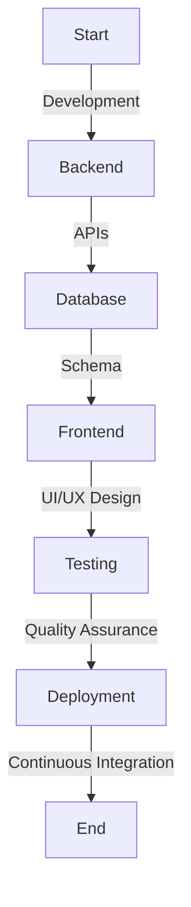

# Project Status

- [ ] Database Schema Completed
- [ ] Backend APIs Developed
- [ ] Frontend Implementation Ongoing
- [ ] Testing and QA in Progress
- [ ] Continuous Integration Set Up
- [ ] Deployment Planning
- [ ] Project Completion

# Project Checklist

## Topics
- [ ] Chat Messaging
- [ ] Media Sharing
- [ ] Online Meetings
- [ ] Syllabus Learning
- [ ] Discussions/Doubts
- [ ] Private Mode
- [ ] User Profiles
- [ ] Role Management
- [ ] Content Categories
- [ ] College-mail Sign-in

## Categories
- [ ] Backend Development
- [ ] Frontend Development
- [ ] Database Management
- [ ] User Experience (UI/UX)
- [ ] Security Implementation
- [ ] Version Control
- [ ] Collaboration and Communication

## Flowchart

